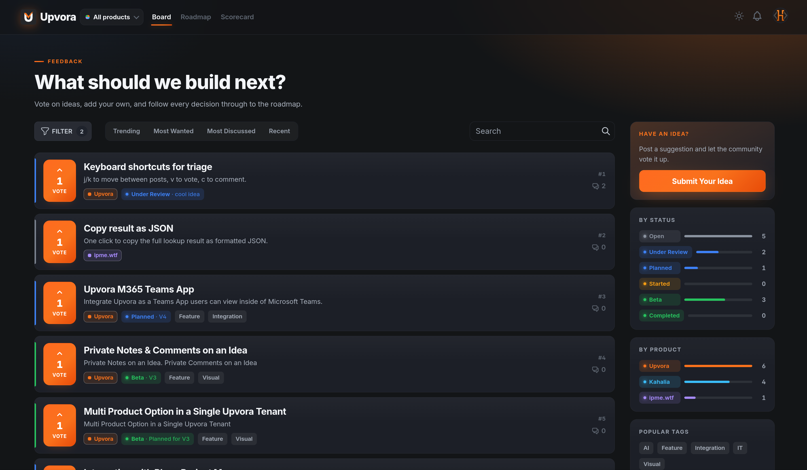
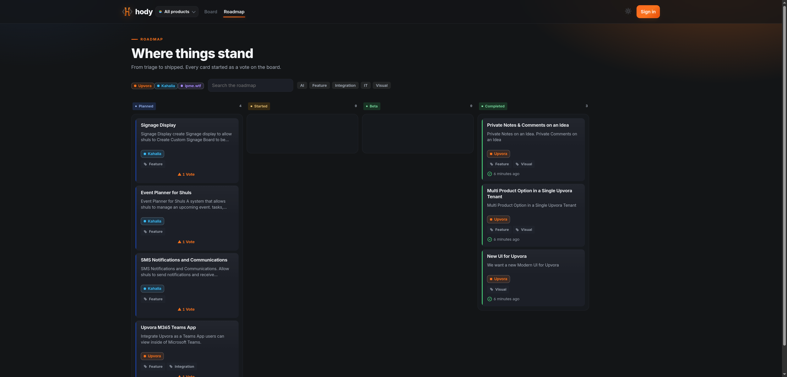

<p align="center">
  <picture>
    <source media="(prefers-color-scheme: dark)" srcset="etc/readme/header-dark.png">
    
  </picture>
</p>

<h3 align="center">Open-source customer feedback, feature voting &amp; product roadmap software</h3>

<p align="center">
  Your users post ideas and vote. Your team scores them in private and ships in the open.<br>
  <b>Self-hosted · multi-product · one Docker image · your data</b>
</p>

<p align="center">
  
  
  
  
  
</p>

<p align="center">
  <a href="#what-you-get">Features</a> •
  <a href="#screenshots">Screenshots</a> •
  <a href="#upvora-vs-fider">Upvora vs Fider</a> •
  <a href="#getting-started-self-hosted">Getting started</a> •
  <a href="#development">Development</a> •
  <a href="#license--attribution">License</a>
</p>

<br>



**Upvora** is the feedback portal you'd build for yourself if you had a spare month: a dark-first, dense, modern UI on top of a battle-tested Go + React engine ([Fider](https://github.com/getfider/fider)). Visitors post ideas, vote, and follow every decision through to a public roadmap. Your team triages with drag-and-drop, deliberates in a private layer no visitor ever sees, and scores candidates on a fully custom scorecard. It runs anywhere Docker runs, with a Postgres database as the only dependency — and once it's up, it updates itself from the admin panel.

If you're comparing Canny, UserVoice, Featurebase, Astuto, or Fider itself and want something **open-source, self-hosted, and genuinely pretty** — this is it.

## What you get

### 🗳️ A feedback board people actually use
Dense, fast, dark-first board with one-click voting straight from the list, optimistic UI, powerful sort tabs (Trending / Most Wanted / Most Discussed / Recent), full-text search with similar-idea detection at post time, tag filters with counts, and rich-text *and* markdown commenting. Every status gets your color, your name, your rules — including which ones appear on the home page.

### 📦 Multi-product, single portal
Run every product you own from one place. Products are a lens, not a wall: one member list, one workflow, but every idea carries an ink-bordered product chip, every product gets its own public board at `/p/your-product`, and **every view — board, roadmap, scorecard — filters to any combination of products** with shareable `?products=` URLs. Unassigned ideas land in a General bucket, never lost.

### 🗺️ A roadmap worth linking to
Status lanes with per-lane counts, search, tag + product filters as toggle chips, inline voting on cards — and for your team, **drag a card between lanes to restatus it**. "What's planned?" becomes a URL you paste, not a meeting.

### 🎯 Prioritization scorecard (team-only)
A committee-style scoring workspace visitors never see: define your own scoring dimensions *and* your own form fields (nine field types), score candidate ideas against weighted criteria, and read the verdict off an SVG progress ring with your thresholds marked on it. Linked to board ideas, so scores follow the idea.

### 🔒 Internal notes & comments
The deliberation layer feedback tools forget: internal comments sit inline in the discussion but are visible only to collaborators — excluded from public counts, never emailed to voters. Plus one shared internal note per idea, live-synced between the idea page and the scorecard. Amber-flagged everywhere so nobody mistakes private for public.

### 🎨 Theme studio
Your brand color and four per-function accents (buttons, votes, links, header) applied as **design tokens** across light and dark mode — set once in the admin, survives every redesign. Default appearance per site (light / dark / follow system), per-product colors, and raw custom CSS still available for everything else.

### 🔄 One-click updates
A System panel under the admin menu shows your installed version against the latest GitHub release (checked daily, re-check on demand) and — with the bundled updater sidecar — **updates your instance from the browser**. No SSH, no runbook, and the recovery steps are printed right on the panel for the day something goes wrong.

### ✦ Vora — an AI ideation agent (optional)
Turn rough thoughts into well-planned ideas: Vora interviews the submitter in chat, then drafts the title, a summary description, suggested tags, and a full **Idea Brief** — a structured plan saved with the post. Everything is reviewed and editable before submitting. Bring your own provider — Anthropic, OpenAI, or any OpenAI-compatible endpoint including a local LLM on your own network — with per-product interview instructions, admin-viewable conversation transcripts, and strict email privacy (the submitter's address is stored only as a token, never rendered to any browser). Off by default; one switch to enable.

### 🔐 Sign-in your users already have
Passwordless email magic links out of the box, plus Google, GitHub, and any OAuth2/OIDC provider (Microsoft, Authentik, Keycloak…) — visitors bring an account they already own.

### ⚙️ And the whole engine underneath
Web + email notifications, webhooks, a REST API with per-user API keys, CSV export, team invitations, post moderation, GDPR-friendly privacy controls, 30+ languages, single-binary Docker image, migrations on boot.

## Screenshots

*The public roadmap — lanes, product chips, toggle filters:*



## Upvora vs Fider

Upvora is a friendly fork of [Fider](https://fider.io) (AGPL-3.0). The engine — data model, API, auth, operational simplicity — is excellent, and Upvora stays close enough to keep merging upstream improvements. On top of it:

| | Fider | Upvora |
|---|---|---|
| Feedback board, voting, discussion | ✅ | ✅ redesigned — dark-first, dense, inline voting |
| Statuses | fixed set | ✅ fully custom (names, colors, home-page visibility) |
| Multiple products per portal | — | ✅ chips, filters, `/p/slug` public boards |
| Public roadmap | — | ✅ lanes, filters, drag-to-restatus |
| Prioritization scorecard | — | ✅ custom dimensions, fields, weighted ring |
| Internal notes & team-only comments | — | ✅ |
| Theming | custom CSS | ✅ token-based color system + custom CSS |
| AI ideation agent (Vora) | — | ✅ optional; BYO provider incl. local LLMs, Idea Briefs, transcripts |
| In-app updates | — | ✅ System panel + updater sidecar |
| Engine, API, SSO, i18n, webhooks | ✅ | ✅ inherited, kept current |

Want the smallest tool with the largest community? Use Fider — it's great. Want everything above out of the box? Welcome.

## Getting started (self-hosted)

One image, one Postgres — and one-click updates included:

```bash
curl -LO https://raw.githubusercontent.com/hodyhq/Upvora/main/docker-compose.example.yml
mv docker-compose.example.yml docker-compose.yml
# edit BASE_URL, secrets and SMTP, then:
docker compose up -d
```

[`docker-compose.example.yml`](docker-compose.example.yml) ships the app, Postgres, and the **updater sidecar** that powers the admin System panel's *Update now* button (the sidecar is self-configuring and the only container holding the Docker socket — remove it if you'd rather update by hand). Migrating from Fider? Keep your database and env values, swap the compose for this one, and the migrations upgrade your data on first boot.

Or hand-rolled, without the updater:

```yaml
# docker-compose.yml
services:
  db:
    image: postgres:17
    environment:
      POSTGRES_USER: upvora
      POSTGRES_PASSWORD: change-me
      POSTGRES_DB: upvora
    volumes: [db-data:/var/lib/postgresql/data]

  app:
    image: ghcr.io/hodyhq/upvora:latest   # or pin a release tag, e.g. :v0.36.1.4.9
    depends_on: [db]
    ports: ["3000:3000"]
    environment:
      BASE_URL: https://feedback.yourdomain.com
      DATABASE_URL: postgres://upvora:change-me@db:5432/upvora?sslmode=disable
      JWT_SECRET: generate-a-long-random-secret
      EMAIL_NOREPLY: noreply@yourdomain.com
      EMAIL_SMTP_HOST: smtp.yourprovider.com
      EMAIL_SMTP_PORT: "587"
      EMAIL_SMTP_USERNAME: your-smtp-user
      EMAIL_SMTP_PASSWORD: your-smtp-password
      EMAIL_SMTP_ENABLE_STARTTLS: "true"

volumes:
  db-data:
```

```bash
docker compose up -d
```

(Prefer building from source? `docker build -t upvora .` in this repo produces the same image.)

Migrations run on start; the app serves on port `3000`. Put a TLS-terminating proxy in front (Traefik, Caddy, nginx, or a Cloudflare tunnel) and open `BASE_URL`. Tag-on-post and Prometheus metrics (`:4000`, keep it internal) ship enabled; social sign-in is two env vars away (`OAUTH_GOOGLE_*`, `OAUTH_GITHUB_*`).

**One-click updates:** included in [`docker-compose.example.yml`](docker-compose.example.yml). On an existing deployment, copy its `updater` service + `updater-shared` volume + the two `updater` lines on the app service into your compose (the System panel in the admin also shows these instructions when the sidecar is missing). The sidecar holds the Docker socket so the app container never has to — the app only writes an empty trigger file.

## Development

Node 22, Go 1.25, Docker (for Postgres):

```bash
make watch          # hot-reload server + UI
make lint           # golangci-lint + eslint
make test           # server + UI unit tests
```

CI runs the same checks on every merge request into `main`.

## License & attribution

Upvora is licensed under the **GNU Affero General Public License v3.0** — see [`LICENSE`](LICENSE). It is a derivative work of [getfider/fider](https://github.com/getfider/fider) (also AGPL-3.0); the original Fider copyright notices are retained. If you run a modified copy as a network service, the AGPL requires you to make your source available to its users.

Upvora is an independent project and is not affiliated with or endorsed by the Fider team.
